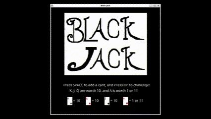

# BlackJack-C

このプロジェクトは、以前Javaを使用して制作したブラックジャックのゲームを、C言語学習のためにSDL2を使用して作り直したものになります。今後もアップデート予定です。

Java版はこちらです→[BruCandy/BlackJack](https://github.com/BruCandy/BlackJack)

## ファイル構成
このプロジェクトの主要なディレクトリとファイルの構成について説明します。

- **主なディレクトリ・ファイル**
  - `data/fonts` : ゲームで使用するフォントを格納
  - `data/images` : ゲームで使用する画像を格納（すべて自作）
  - `assets.c` : 画像やテキストファイルの準備
  - `assets.h` : `assets.c`のヘッダファイル
  - `dealer.c` : ディーラーのカード操作
  - `dealer.h` : `dealer.c`のヘッダファイル
  - `deck.c` : デッキ操作
  - `deck.h` : `deck.c`のヘッダファイル
  - `hand.c` : 手札操作
  - `hand.h` : `hand.c`のヘッダファイル
  - `main.c` : メインファイル
  - `screen.c` : ゲーム画面描画
  - `screen.h` : `screen.c`のヘッダファイル
  - `types.h` : 様々な列挙型、構造体を定義

## 実装方法
Ubuntu 22.04にて動作の確認を行いました。以下の手順で実行が可能です。

### 1.必要なライブラリのインストール
```bash
sudo apt update
sudo apt install build-essential libsdl2-dev libsdl2-image-dev libsdl2-ttf-dev
```

### 2.ビルドと実行
```bash
make        # ビルド
./blackjack # 実行
```

### 3.クリーン
```bash
make clean
```

## 実装結果

以下にゲームをプレイしている様子を示します。GitHubに乗せる都合上4倍速にしているため、本来はかなり遅いです。

<div align="center">
  
</div>


## 問題と課題
- 動きがカクついている
- キーボードの連打でコアダンプエラーが発生する時がある

## 今後のアップデート予定
- コードの整理
- 動きの制度を向上
- コアダンプエラーの解消

## フォントについて
このプロジェクトでは、Google提供の[Noto Sans](https://fonts.google.com/specimen/Noto+Sans)フォントを使用しています。このフォントは SIL Open Font License 1.1 のもとで配布されています。

フォントファイルは`data/fonts/NotoSans-Regular.ttf`に配置されており、ライセンスファイル（OFL.txt）も同梱しています。